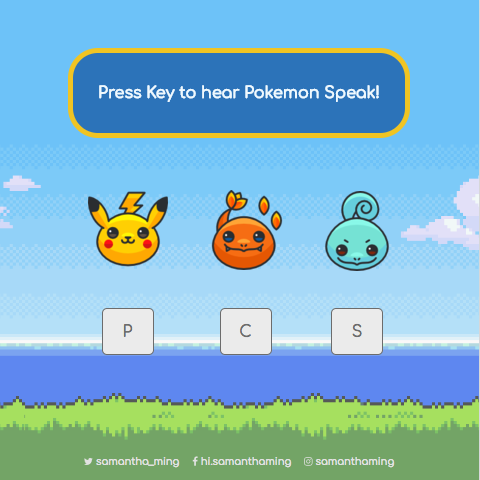

# Not Fancy Pokemon Speak

A simple, not fancy at all, Pokemon Speak web app. Make the Pokemon speak using your keyboard!

**Features include:**
- Play sound when Pokemon speaks
- Display text when Pokemon speaks
- Clear text and show welcome message when inactive

**Built using:**
- Vue
- Font Awesome
- Google Fonts - Comfortaa

<br>

Play around with it on [CodePen](https://codepen.io/samanthaming/pen/MXBYNJ)  
Or see it live! [here](https://samanthaming.github.io/not-fancy-pokemon-speaks/)

<br>



# Notes

Here are the general steps to create your own Pokemon Speak

## 1. Listen to Keyboard Events

Vue doesn't support global key press (at least I couldn't figure it out), so we need to `addEventListener` to the window.

```javascript
new Vue({ 
  created () {
    window.addEventListener('keydown', this.selectPokemon)
  },
})
```

## 2. Responding to Keyboard Events

```javascript
methods: {
  selectPokemon(e) {
    // Create an array of all your key codes
    //  ie. [80, 67, 83]
    const keys = this.pokemons.map(pokemon => pokemon.code);
    
    // Retrieve the pressed key code 
    //  ie. 80 is for key "p"
    const code = e.keyCode;
    
    // Loop through your pokemon array and get the selected pokemon
    const selectedPokemon = this.pokemons.find(pokemon => pokemon.code === code)

    // Update the property of the selected pokemon
    selectedPokemon.selected = true;
  },
}
```

## 3. Play Sound

```javascript
methods: {
  selectPokemon(e) {
    
    // Pass in the path of your sound file
    this.playSound(`sounds/${selectedPokemon.file}.mp3`)
  },
  playSound(sound) {
    
    // Create the audio
    var audio = new Audio(sound);
    
    // Play the audio
    audio.play();
  },
}
```

# Resources

- [Vue Key Modifiers](https://vuejs.org/v2/guide/events.html#Key-Modifiers)
- [JS Event KeyCodes by WesBos](http://keycode.info/)
- Images from [Pokemon Sprites Pack](https://www.pokemongoapkfree.com/pokemon-sprites-pack-images/)
- Sound clips from YouTube
- [Stack overflow: How to detect idle time in JS](https://stackoverflow.com/questions/667555/how-to-detect-idle-time-in-javascript-elegantly)
- This project was inspired by WesBos' [Javascript30](https://javascript30.com/) - Drum Kit lecture.
